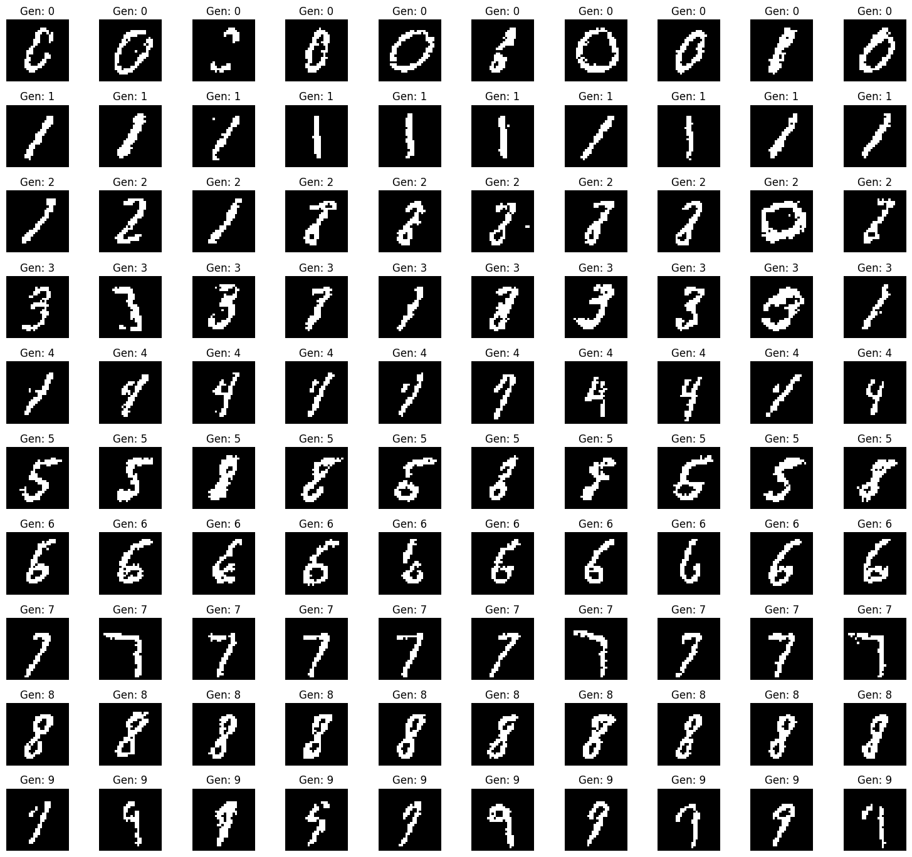

# Deep Belief Network

## Overview

<!-- First, we'll implement RBM(Restricted Boltzmann Machine) and then use it to build a Deep Belief Network (DBN). -->

## Model

### RBM and GRBM

## Training

### MLE and CD-k

## As a Generative Model

### Conditional Generation

RBM for conditional generation on MNIST

### Generative Discriminator

RBM for generative discriminator on MNIST

Test set classification accuracy: 94.07%

## References

