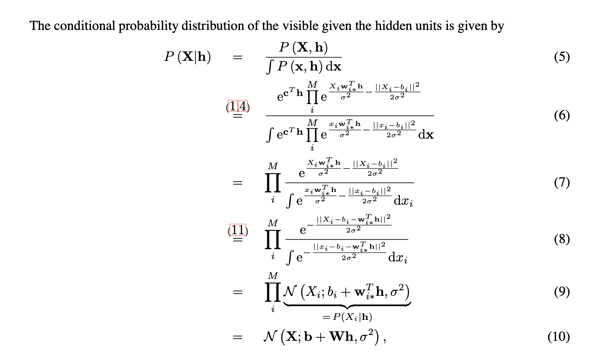

https://aistudio.google.com/prompts/1ysTIitsW0X8fFiMJoNJ2fBnlo-Nl3jiQ

[Gaussian-binary Restricted Boltzmann Machines on Modeling Natural Image Statistics](https://arxiv.org/pdf/1401.5900)

Mathematics behind the sampling steps and the free energy calculation for the Gaussian-Bernoulli RBM (GRBM) implemented in the code, assuming the visible units have a standard deviation $\sigma=1$.

We'll use the following notation:
*   $v \in \mathbb{R}^{n_v}$: Vector of visible units (continuous).
*   $h \in \{0, 1\}^{n_h}$: Vector of hidden units (binary).
*   $W \in \mathbb{R}^{n_h \times n_v}$: Weight matrix connecting hidden and visible units.
*   $b \in \mathbb{R}^{n_v}$: Bias vector for visible units (`v_bias` in code).
*   $c \in \mathbb{R}^{n_h}$: Bias vector for hidden units (`h_bias` in code).
*   $\sigma_i$: Standard deviation of the $i$-th visible unit (assumed to be 1 for all $i$ in the code).

**1. Energy Function**

The energy function defines the probability distribution $P(v, h) = \frac{1}{Z} e^{-E(v, h)}$. For a GRBM with visible standard deviation $\sigma_i$ for unit $v_i$, the energy function is commonly defined as:
\[
E(v, h) = \sum_{i=1}^{n_v} \frac{(v_i - b_i)^2}{2\sigma_i^2} - \sum_{j=1}^{n_h} c_j h_j - \sum_{i=1}^{n_v} \sum_{j=1}^{n_h} h_j \frac{W_{ji}}{\sigma_i^2} v_i
\]
Assuming $\sigma_i = 1$ for all $i$, this simplifies to:
\[
E(v, h) = \sum_{i=1}^{n_v} \frac{(v_i - b_i)^2}{2} - \sum_{j=1}^{n_h} c_j h_j - \sum_{i=1}^{n_v} \sum_{j=1}^{n_h} h_j W_{ji} v_i
\]
In vector notation:
\[
E(v, h) = \frac{1}{2} \|v - b\|^2 - c^T h - h^T W v
\]

**2. Conditional Probability of Hidden Units given Visible Units ($P(h|v)$)**

This is needed for `sample_h(v)`. Since hidden units are conditionally independent given $v$, we can look at a single hidden unit $h_j$.
\[
P(h_j=1 | v) = \frac{P(h_j=1, v)}{P(v)} = \frac{\sum_{h_{\neg j}} P(v, h_j=1, h_{\neg j})}{\sum_{h} P(v, h)}
\]
A simpler way is to use the sigmoid form derived from the energy difference:
\[
P(h_j=1 | v) = \text{sigmoid}(\Delta E_j)
\]
where $\Delta E_j$ is the energy difference related to flipping $h_j$ from 0 to 1. Specifically, $\Delta E_j = E(v, h_j=0) - E(v, h_j=1)$. Let's calculate this difference using the energy function (terms not involving $h_j$ cancel out):
$$
\begin{align*} 
\Delta E_j &= \left( \dots - 0 - 0 \right) - \left( \dots - c_j - \sum_i W_{ji} v_i \right) \\ &= c_j + \sum_i W_{ji} v_i
\end{align*}
$$
This term $\sum_i W_{ji} v_i$ is the $j$-th component of the vector $Wv$.
So, the conditional probability is:
\[
P(h_j=1 | v) = \text{sigmoid}\left( c_j + \sum_{i=1}^{n_v} W_{ji} v_i \right)
\]
In vector notation for all hidden units:
\[
P(h=1 | v) = \text{sigmoid}(c + Wv)
\]
This directly corresponds to the code: `prob_h = torch.sigmoid(F.linear(v, self.W, self.h_bias))`. Sampling $h_j$ is then done by drawing from a Bernoulli distribution with this probability.

**3. Conditional Probability of Visible Units given Hidden Units ($P(v|h)$)**

This is needed for `sample_v(h)`. Since visible units are conditionally independent given $h$, we look at a single visible unit $v_i$.
\[
P(v_i | h) \propto \exp(-E(v, h)_{\text{terms involving } v_i})
\]
The terms in the energy function involving $v_i$ (assuming $\sigma_i=1$) are:
\[
E(v, h)_{\text{terms involving } v_i} = \frac{(v_i - b_i)^2}{2} - \sum_{j=1}^{n_h} h_j W_{ji} v_i
\]
We want to recognize this as the exponent of a Gaussian distribution $\mathcal{N}(v_i | \mu_i, \sigma_i^2)$, where the PDF is proportional to $\exp\left(-\frac{(v_i - \mu_i)^2}{2\sigma_i^2}\right)$. Let's complete the square for the terms involving $v_i$:
$$
\begin{align*} \frac{(v_i - b_i)^2}{2} - \sum_j h_j W_{ji} v_i &= \frac{1}{2} (v_i^2 - 2 v_i b_i + b_i^2) - \sum_j h_j W_{ji} v_i \\ &= \frac{1}{2} \left( v_i^2 - 2 v_i b_i - 2 v_i \sum_j h_j W_{ji} + b_i^2 \right) \\ &= \frac{1}{2} \left( v_i^2 - 2 v_i \left( b_i + \sum_j h_j W_{ji} \right) + b_i^2 \right)\end{align*}
$$
Comparing the term linear in $v_i$, $-2 v_i \left( b_i + \sum_j h_j W_{ji} \right)$, with the Gaussian exponent's linear term, $-2 v_i \mu_i / (2\sigma_i^2)$, and using $\sigma_i=1$, we identify the mean $\mu_i$:
\[
\mu_i = b_i + \sum_{j=1}^{n_h} h_j W_{ji}
\]
The variance is determined by the coefficient of the $v_i^2$ term, which is $1/2$, corresponding to $\sigma_i^2 = 1$.
Thus, the conditional distribution is Gaussian:
\[
P(v_i | h) = \mathcal{N}(v_i | \mu_i = b_i + \sum_j W_{ji} h_j, \sigma_i^2 = 1)
\]
The term $\sum_j W_{ji} h_j$ is the $i$-th component of the vector $W^T h$.
In vector notation for all visible units:
\[
P(v | h) = \mathcal{N}(v | \mu = b + W^T h, I)
\]
where $I$ is the identity matrix (representing $\sigma_i=1$ for all $i$).
Sampling $v$ given $h$ therefore involves calculating the mean $\mu = b + W^T h$ and drawing a sample from a multivariate Gaussian with this mean and identity covariance. This matches the code: `mean_v = F.linear(h, self.W.t(), self.v_bias)` followed by `v_sample = mean_v + torch.randn_like(mean_v)`.

**4. Free Energy ($F(v)$)**

The free energy is defined as $F(v) = -\log \sum_h e^{-E(v, h)}$. It marginalizes out the hidden variables.
$$
\begin{align*} F(v) &= -\log \sum_h \exp\left( -\sum_i \frac{(v_i - b_i)^2}{2} + \sum_j c_j h_j + \sum_{i,j} h_j W_{ji} v_i \right) \\ &= \sum_i \frac{(v_i - b_i)^2}{2} - \log \sum_h \exp\left( \sum_j c_j h_j + \sum_{i,j} h_j W_{ji} v_i \right) \quad \text{(Pulling out v-dependent term)} \\ &= \sum_i \frac{(v_i - b_i)^2}{2} - \log \sum_h \exp\left( \sum_j h_j \left( c_j + \sum_i W_{ji} v_i \right) \right)\end{align*}
$$
Let $x_j(v) = c_j + \sum_i W_{ji} v_i$. This is the pre-sigmoid activation for $h_j$ we found earlier.
\[
F(v) = \sum_i \frac{(v_i - b_i)^2}{2} - \log \sum_{h \in \{0,1\}^{n_h}} \prod_{j=1}^{n_h} e^{h_j x_j(v)}
\]
Since the sum factorizes over the independent choices for each $h_j$:
$$
\begin{align*} \sum_{h \in \{0,1\}^{n_h}} \prod_{j=1}^{n_h} e^{h_j x_j(v)} &= \left( \sum_{h_1 \in \{0,1\}} e^{h_1 x_1(v)} \right) \dots \left( \sum_{h_{n_h} \in \{0,1\}} e^{h_{n_h} x_{n_h}(v)} \right) \\ &= \prod_{j=1}^{n_h} (e^{0 \cdot x_j(v)} + e^{1 \cdot x_j(v)}) \\ &= \prod_{j=1}^{n_h} (1 + e^{x_j(v)})\end{align*}
$$
Substituting this back into the free energy expression:
\[
F(v) = \sum_i \frac{(v_i - b_i)^2}{2} - \log \left( \prod_{j=1}^{n_h} (1 + e^{x_j(v)}) \right)
\]
\[
F(v) = \sum_{i=1}^{n_v} \frac{(v_i - b_i)^2}{2} - \sum_{j=1}^{n_h} \log(1 + e^{x_j(v)})
\]
Using the softplus function, $\text{softplus}(x) = \log(1 + e^x)$:
\[
F(v) = \sum_{i=1}^{n_v} \frac{(v_i - b_i)^2}{2} - \sum_{j=1}^{n_h} \text{softplus}\left( c_j + \sum_i W_{ji} v_i \right)
\]
This corresponds exactly to the implementation in the `free_energy` method of the `GaussianBernoulliRBM` class:
*   `visible_term = torch.sum(0.5 * (v - self.v_bias)**2, dim=1)` calculates $\sum_{i=1}^{n_v} \frac{(v_i - b_i)^2}{2}$.
*   `wx_b = F.linear(v, self.W, self.h_bias)` calculates the vector of $x_j(v) = c_j + \sum_i W_{ji} v_i$.
*   `hidden_term = torch.sum(F.softplus(wx_b), dim=1)` calculates $\sum_{j=1}^{n_h} \text{softplus}(x_j(v))$.
*   The function returns `visible_term - hidden_term`.

---

Okay, let's update the mathematical derivations for the GRBM now that the standard deviation $\sigma_i$ for each visible unit $v_i$ is a learnable parameter.

We parameterize the standard deviation via its logarithm: $s_i = \log \sigma_i$, so $\sigma_i = e^{s_i}$ and the variance is $\sigma_i^2 = e^{2s_i}$. The learnable parameter in the code is `log_std`, which corresponds to $s = (s_1, ..., s_{n_v})$.

**1. Updated Energy Function**

The energy function now explicitly includes the learnable variance $\sigma_i^2 = e^{2s_i}$:
\[
E(v, h; W, b, c, s) = \sum_{i=1}^{n_v} \frac{(v_i - b_i)^2}{2\sigma_i^2} - \sum_{j=1}^{n_h} c_j h_j - \sum_{i=1}^{n_v} \sum_{j=1}^{n_h} h_j \frac{W_{ji}}{\sigma_i^2} v_i
\]
Substituting $\sigma_i^2 = e^{2s_i}$:
\[
E(v, h) = \sum_{i=1}^{n_v} \frac{(v_i - b_i)^2}{2 e^{2s_i}} - \sum_{j=1}^{n_h} c_j h_j - \sum_{i=1}^{n_v} \sum_{j=1}^{n_h} h_j \frac{W_{ji}}{e^{2s_i}} v_i
\]
*Note: For brevity, we'll often write $\sigma_i^2$ but remember it's derived from the learnable parameter $s_i$.*

**2. Conditional Probability of Hidden Units given Visible Units ($P(h|v)$)**

This calculation follows the same logic as before, using the energy difference $\Delta E_j = E(v, h_j=0) - E(v, h_j=1)$. The terms involving $h_j$ are $- c_j h_j - \sum_i h_j \frac{W_{ji}}{\sigma_i^2} v_i$.
\[
\Delta E_j = \left( 0 \right) - \left( - c_j - \sum_i \frac{W_{ji}}{\sigma_i^2} v_i \right) = c_j + \sum_{i=1}^{n_v} W_{ji} \frac{v_i}{\sigma_i^2}
\]
The conditional probability for a single hidden unit $h_j$ is:
\[
P(h_j=1 | v) = \text{sigmoid}\left( c_j + \sum_{i=1}^{n_v} W_{ji} \frac{v_i}{\sigma_i^2} \right) = \text{sigmoid}\left( c_j + \sum_{i=1}^{n_v} W_{ji} \frac{v_i}{e^{2s_i}} \right)
\]
In vector notation, if $V_{\text{scaled}}$ is a vector with elements $v_i / \sigma_i^2$:
\[
P(h=1 | v) = \text{sigmoid}(c + W V_{\text{scaled}})
\]
This precisely matches the code:
*   `var = self.get_var()` computes $\sigma_i^2$ for all $i$.
*   `v_scaled = v / var` computes the scaled visible vector.
*   `activation = F.linear(v_scaled, self.W, self.h_bias)` computes $c + W V_{\text{scaled}$.
*   `prob_h = torch.sigmoid(activation)` computes the probability.

**3. Conditional Probability of Visible Units given Hidden Units ($P(v|h)$)**

We examine the terms in $E(v,h)$ involving a single $v_i$:
\[
E(v, h)_{\text{terms involving } v_i} = \frac{(v_i - b_i)^2}{2\sigma_i^2} - \sum_{j=1}^{n_h} h_j \frac{W_{ji}}{\sigma_i^2} v_i
\]
Again, we complete the square for $v_i$ to match the Gaussian form $\exp\left(-\frac{(v_i - \mu_i)^2}{2\sigma_i^2}\right)$:
\begin{align*} \frac{(v_i - b_i)^2}{2\sigma_i^2} - \sum_j h_j \frac{W_{ji}}{\sigma_i^2} v_i &= \frac{1}{2\sigma_i^2} \left[ (v_i^2 - 2 v_i b_i + b_i^2) - 2 v_i \sum_j h_j W_{ji} \right] \\ &= \frac{1}{2\sigma_i^2} \left[ v_i^2 - 2 v_i \left( b_i + \sum_j h_j W_{ji} \right) + b_i^2 \right] \\ &= \frac{1}{2\sigma_i^2} \left[ \left( v_i - \left( b_i + \sum_j h_j W_{ji} \right) \right)^2 - \left( b_i + \sum_j h_j W_{ji} \right)^2 + b_i^2 \right]\end{align*}
Ignoring terms constant w.r.t. $v_i$, the relevant part for the distribution shape is proportional to $\exp\left( - \frac{ (v_i - \mu_i)^2 }{ 2\sigma_i^2 } \right)$, where we identify:
*   **Mean:** $\mu_i = b_i + \sum_{j=1}^{n_h} h_j W_{ji}$ (This is the $i$-th component of $b + W^T h$). Crucially, the mean **does not** depend on $\sigma_i$.
*   **Variance:** $\sigma_i^2 = e^{2s_i}$. This is the variance term from the energy function itself.

So, the conditional distribution for $v_i$ given $h$ is:
\[
P(v_i | h) = \mathcal{N}(v_i \,|\, \mu_i = b_i + \sum_j W_{ji} h_j, \, \sigma_i^2 = e^{2s_i})
\]
In vector notation:
\[
P(v | h) = \mathcal{N}(v \,|\, \mu = b + W^T h, \, \Sigma)
\]
where $\Sigma$ is a diagonal covariance matrix with $\Sigma_{ii} = \sigma_i^2 = e^{2s_i}$.

This matches the code:
*   `mean_v = F.linear(h, self.W.t(), self.v_bias)` computes the mean vector $\mu$.
*   `std_dev = self.get_std()` computes the vector of standard deviations $\sigma_i = e^{s_i}$.
*   `v_sample = mean_v + noise * std_dev_batch` samples from $\mathcal{N}(\mu, \Sigma)$.

**4. Free Energy ($F(v)$)**

Starting from $F(v) = -\log \sum_h e^{-E(v, h)}$:
\begin{align*} F(v) &= -\log \sum_h \exp\left( -\sum_i \frac{(v_i - b_i)^2}{2\sigma_i^2} + \sum_j c_j h_j + \sum_{i,j} h_j \frac{W_{ji}}{\sigma_i^2} v_i \right) \\ &= \sum_i \frac{(v_i - b_i)^2}{2\sigma_i^2} - \log \sum_h \exp\left( \sum_j h_j \left( c_j + \sum_i W_{ji} \frac{v_i}{\sigma_i^2} \right) \right)\end{align*}
Let $x_j(v) = c_j + \sum_i W_{ji} \frac{v_i}{\sigma_i^2}$ (the pre-sigmoid activation for $h_j$). The sum over $h$ factorizes as before: $\sum_h \exp(...) = \prod_j (1 + e^{x_j(v)})$.
\[
F(v) = \sum_{i=1}^{n_v} \frac{(v_i - b_i)^2}{2\sigma_i^2} - \sum_{j=1}^{n_h} \log(1 + e^{x_j(v)})
\]
Substituting the definition of $x_j(v)$ and using the softplus function:
\[
F(v) = \sum_{i=1}^{n_v} \frac{(v_i - b_i)^2}{2\sigma_i^2} - \sum_{j=1}^{n_h} \text{softplus}\left( c_j + \sum_i W_{ji} \frac{v_i}{\sigma_i^2} \right)
\]
Substituting $\sigma_i^2 = e^{2s_i}$:
\[
F(v) = \sum_{i=1}^{n_v} \frac{(v_i - b_i)^2}{2 e^{2s_i}} - \sum_{j=1}^{n_h} \text{softplus}\left( c_j + \sum_i W_{ji} \frac{v_i}{e^{2s_i}} \right)
\]
*Note: A more complete definition of free energy related to the log probability includes a term dependent on the determinant of the covariance matrix, $-\log \sqrt{2\pi\sigma_i^2} = -\frac{1}{2}\log(2\pi) - s_i$. This would add a term $-\sum_i s_i$ to the free energy. However, for the purpose of calculating gradients via the difference $F(v_{data}) - F(v_{model})$ used in CD/PCD, this term often cancels or its gradient w.r.t. $v$ is zero. The formulation above is sufficient for deriving the correct gradients for $W, b, c, s$ via autograd based on the energy difference.*

This free energy calculation matches the code:
*   `var = self.get_var()` gets $\sigma_i^2$.
*   `visible_term = torch.sum(0.5 * ((v - self.v_bias)**2) / var, dim=1)` is the first sum.
*   `v_scaled = v / var`, `wx_b = F.linear(v_scaled, self.W, self.h_bias)` compute the argument to softplus.
*   `hidden_term = torch.sum(F.softplus(wx_b), dim=1)` is the second sum.
*   The function returns `visible_term - hidden_term`.

**5. Gradient Calculation (via Autograd)**

With the learnable $\sigma_i$ (parameterized by $s_i$), deriving the gradients manually becomes more complex, especially for $s_i$. The implementation now relies on PyTorch's autograd feature.

The training objective (for both CD and MLE) is to minimize the difference between the free energy of the data samples and the free energy of the model's generated samples (fantasy particles):
\[
\mathcal{L}(\theta) = \mathbb{E}_{v \sim P_{\text{data}}}[F(v; \theta)] - \mathbb{E}_{v \sim P_{\text{model}}}[F(v; \theta)]
\]
where $\theta = \{W, b, c, s\}$. This difference is approximated using batches:
\[
\mathcal{L}(\theta) \approx \frac{1}{N} \sum_{n=1}^N F(v^{(n)}_{\text{data}}; \theta) - \frac{1}{N} \sum_{n=1}^N F(v^{(n)}_{\text{model}}; \theta)
\]
By computing `loss = torch.mean(fe_positive - fe_negative)` and calling `loss.backward()`, PyTorch automatically computes the gradients $\frac{\partial \mathcal{L}}{\partial W}$, $\frac{\partial \mathcal{L}}{\partial b}$, $\frac{\partial \mathcal{L}}{\partial c}$, and crucially $\frac{\partial \mathcal{L}}{\partial s}$ using the chain rule through the free energy calculations. These gradients are then used by the optimizer.
